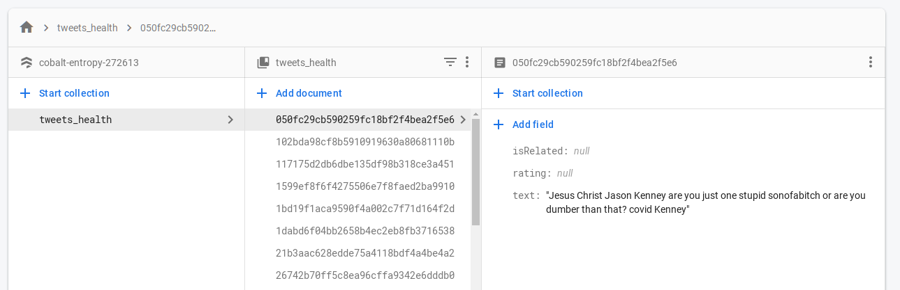
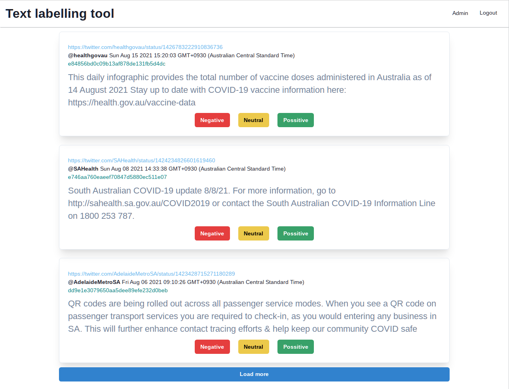

# SentimentToan

### Dependencies
* Selenium
    ```
    pip install selenium
    ```
    [setup instruction](https://selenium-python.readthedocs.io/installation.html)
  
* Firebase
    ```
    pip install --upgrade firebase-admin
    ```
    [setup instruction](https://firebase.google.com/docs/firestore/quickstart#python)
* FastAPI
  ```
  pip install fastapi
  ```
### Workflow
#### 1. Scrap data from social media
- [x] This project will collect data from:
  - [x] Twitter:
    - [x] Tweets with specifice keywords and/or hashtags
      - [x] dynamic keywords and/or hashtags
      - [x] Tweet's text
      - [x] Tweet's account id
      - [x] Tweet's post time
      - [x] Tweet's original link
      - [ ] Tweet's replies
      - [ ] Tweet's retweet
      - [ ] Tweet's likes
    - [x] Tweets from specific accounts
      - [x] dynamic accounts list
      - [x] Tweet's text
      - [x] Tweet's account id
      - [x] Tweet's post time
      - [x] Tweet's original link
      - [ ] Tweet's replies
      - [ ] Tweet's retweet
      - [ ] Tweet's likes
- [x] Wrap above functionalities with FastAPI
  - run ```uvicorn fast:app --reload```
    - ```fast``` is this project's ```fast.py```
    - ```app``` is ```fast```'s FastAPI object
- [ ] To the cloud

#### 2. Store online
- [x] Collected data will be stored in [this Google's Firestore project](https://console.firebase.google.com/u/0/project/cobalt-entropy-272613/firestore/). You will need permission for accessing it. Current data structure is ```outdated```:

> `tweets_health` collection name
> > `id` data.text's MD5 hash
> >> `isRelated` `= null` indicates this text is related to health topic \
> \
> >> `rating` `=null` -2 (very negative), -1(negative), 0 (neutral), 1(possitive) 2 (very possitive) \
> \
> >> `text` collected data


#### 3. Label
- [x] Build web app that:
  - [x] Support log in
  - [ ] Support run modes:
    - [ ] Filter by list of account Ids
    - [ ] Filter by list keywords
  

  - [x] Load storing unlabelled data
  - [x] Update rating as 3 levels: negative, neutral, possitive
- [ ] To the cloud
  
#### 4. Sentiment analys data
(tbd)